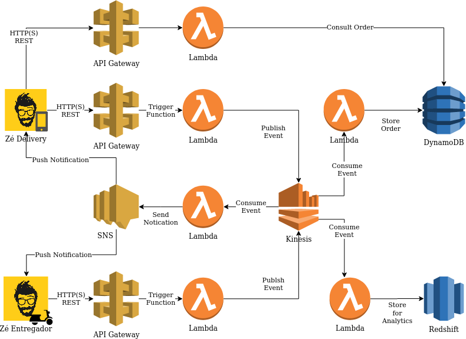

# Zé Delivery Challenge
Challenge of Data Engineer position at Zé Delivery 

## The Challenge

With the current volume of orders being sold at Zé, we expect to receive around 1M records of coordinates each day - we are considering that every courier will use the new app and this volume will grow each month following Zé's growth.  

The app is almost finished, and the couriers are already able to manage the order's information while associtaing them with the delivery of it, inform that the devivery of the order is starting, and also assign that the order was just delivered - we expect they do this when actually delivering the beverages to the consumer. So, for every action that the courier does regarding each order, we are collecting the location using the device's GPS sensor. Besides these moments, we are also collecting location data while the courier is driving to the consumer's place - this way we expect to send notifications to the consumer that his/her order is arriving or just arrived, for instance.

Regarding the infrastructure on our cloud that will receive all this data, we are really delayed, and it is exactly where we need your help, to help us answering these questions:

* How are we going to receive all the location data from the couriers' app? What protocols, services, components we are going to use to proper receive the data, store it and be available to be used in other products. 
  * Should we create an API for it? 
  * Should we use some specific managed component to receive this information? 
  * Should we use queues, pub-sub mechanisms, serverless components? 
* While receiving this location data associed with order's information, imagine we need to ingest more information to it. 
  * How would we do this? 
  * In which layer that you have proposed in the previous answer?
* We need to create an API to retrieve the last retrieved location from an order. 
  * How do you propose us to do this? 
  * While receiving location data, can you elaborate a solution to store the order's last location information? 
* If we need to notify the users about each order's status, how would you implement this while collecting the data?
* How to store the data and how to make it available to be queried by our Data Analytics team? 

## The proposed architecture

I believe that technologies that I have chosen will solve the problem at hand:

- API Gateway
- Lambda Function
- SNS
- Kinesis
- DynamoDB
- Redshift

 

### The customer placed the order

As introduced before, the infrastructure will receive around 1M geolocations requests per day. For that problem, I chose to use **Kinesis** for *event driven design*, because, when the customer make the order. The app Zé Delivery will send a HTTP request for **API Gateway**, that will trigger the **Lambda Function**. Than will publish the event to **Kinesis** and the **Kinesis** will send the data for 3 Consumers: **DynamoDB, Redshift and SNS**.

**DynamoDB** will be in charge to store the data for customer and courier consult. So We will have a API for consult the order status.

At the same time, **Redshift** will store the data for analytics, so the Analytics team can do analysis with Amazon Quicksight or Athena, or even ML tools (e.g. SageMaker and EMR).

**SNS** will send push notification for Zé Entregador app.

 

### The courier update the order

When the Ze Entregador app update the order. The app will send a HTTP request for API Gateway that will do the same strategy as explained before. The **Kinesis** will send a event for SNS, that will send a push notification for Zé Delivery app. The **DynamoDB** will store the data and update the order status and the **Redshift** will store the data for analysis.

 

### The courier geolocation

When the delivery man leaves for delivery, the app will send HTTP requests for **API Gateway** in real-time. Than will trigger a **Lambda Function** that will send data to **Kinesis** and store the data in **Redshift** and **DynamoDB**. 

The customer will can consult the status and the last location of the order with an API.

If the delivery man arrives the location or next to the customer's location. The SNS will send push notification informing the order is arriving or just arrived.

 

## IaC

I chose to use **Amazon CloudFormation** for deploy the resources, because for me, it's more easy to understand and I can validate the template with **AWS SAM** (Simple Application Model).

**Obs: In this exactly moment, SNS mobile push notification is not supported by CloudFormation, so the implementation have to be done by UI or CLI.**

https://github.com/aws-cloudformation/aws-cloudformation-coverage-roadmap/issues/148

